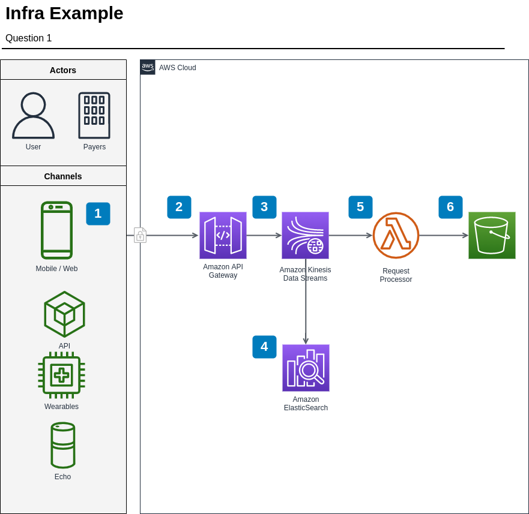

# Data Engineering test for [Sua Música](https://www.suamusica.com.br/)

### 1. How would you handle streaming. Give suggestions about architecture, Technologies, and pipelines that what you would use as Solutions. You can use architecture diagrams and sketches if you like.



The best and easy tool to use about data streaming, for sure, Kinesis Data Streaming.
Following the image that I draw above I would use an API Gateway to have an endpoint, API Gateway it's an excellent resource
to save time when you need to a serveless service API.

The next step, would be the API Gateway sending the data to Kinesis Data Streaming and here, at this point,
we can use another tool to do data analysis in real-time: Kinesis Data Analytics! It's usefull to monitoring the data and metrics
about the data ingestion process.

Later, the Kinesis Data Stream calls a Lambda Function, and here the Lambda Function can do a simple validation or check and to write the
data into a bucket, generally a bucket that it's a raw layer from a data-lake.

### 2. Discuss an optimal strategy of how to handle big data from streaming (track events from platform usage). Give examples of architecture, Technologies, and pipelines that you would use.

I don't have a senior expertise in data streaming, in fact I worked with data streaming only for academic/study purposes.
To track events in data stream, I would consider to use some queue service, like SNS or SQS.

### 3. Give an example of how you would automate a process using serverless Jobs likes AWS lambdas. Discuss the specific example of how would you handle tables in S3 using table partitions to optimize storage and to be cost effective.

AWS Lambda, it's an amazing example of how some serverless services can be very effective and cheap.
The AWS Lambda functions can be used to treat a small amount of data, or small batchs of data, and it's possible to call
a function many times in a row, giving you the possibility to have a kind of parallelized service. Lambda Functions are
incredible and cheap, but aren't a good way to handle with big data. To process big data, we have some others serveless
services better to do it, like Glue Jobs and AWS Batch.

About S3, I would use parquet to store structured data in S3, and parquet because that type of file have a huge support
in a wide variety of languages and frameworks. The table partitions, I would consider some business and technical rules, but in generally,
I say that a daily partition.

### 4. Give a definition and an example of a supervised learning algorithm. Discuss in detail, give a simple example and show some simple code. Explain how would you create a pipeline for this model, and what Technologies would you use. How would you orquestrate the flow, and what type of job you would use to run the machine learning algorithm as cost effective as you can.

A supervised learning algorithm it's an algorithm trained with a dataset with given answer. What I mean: there is a
column in dataset that it's saying/showing the 'answer' or the expected output to the algorithm.

A good example about it: imagine a lungs' images of x-ray dataset from some hospital, and the dataset has a column
indicating if the lung has cancer or not, a boolean variable (True/False). Well, the algorithm training will consider the
column that indicates if the lung has cancer or not. A ML algorithm that can do this is logistic regression, decisions
trees, linear regressions.

### 5. Give a definition and an example of an unsupervised learning algorithm. Discuss in detail, give a simple example and show some simple code. Explain how would you create a pipeline for this model, and what Technologies would you use. How would you orquestrate the flow, and what type of job you would use to run the machine learning algorithm as cost effective as you can.

Unsupervised learning algorithm it's a model that was trained 'freely', without an expected or given answer. Without it,
the model it's more or less, free to figure out patterns itself.

An example: I have a supermarket, and I would like to understand the consumer patterns of my constummers, considering
order day and time, which products they buy together, their ages and other data that I have. I could use a K-means to
understand the orders patterns and extract some insights.

### 6. Discuss everything you know about airflow. Give examples of how you used this technology in real projects from Your previous experience as a data engineer.

Airflow it's a stunning framework to orchestrate workloads flows and data pipelines. I started to use Airflow in 2020
when I was working at Clicksign and we needed to build a lot of data pipelines and to automate workloads and other
processes.

Airflow it's entirely build on python and has a very fast deploy using docker. A good documentation and very nice UI.
Airflow works with DAG (Directed Acyclic Graph) and tasks inside that contains the code to be executed. Airflow isn't a
framework to process data, the main concept of Airflow is to manage flows.

With a lot off plugins that can connect basically with any databases and clouds and services to process data, or send
messages, alerts, reports. My favorite thing about Airflow it's the possibility do build easily frameworks and customize
it.

### 7. Give na example of an ETL using mockup or real data. Use at least one join, one Where clause, one group by, and at least three special functions such as rank, max, mean, sum, avg, so on and so forth. You can use Pysql, or pandas if you will. Explain how you would create a gold datalake to a Analytics layer for example a tableau server. Use Your github to showcase Your answer, and use some API to store the data (for example Google API, or even a google drive personal account).

### 8. Explain the subtle differences between ETL and ELT. Give theoretical examples, and real examples from Your previous experience as a data engineer. Give details of the Technologies, and the pipeline that you used or helped create on the Project you are describing.

ETL: Extract - Transform - Load

ELT: Extract - Load - Transform

The ETL, it's the most 'traditional' way to handle with data and should be used with careful, because when you need to
handle with big data, and you try to use ETL, this means that you will need to use a data streaming tool into your pipeline.
Data streaming tools are expensive and more complex to use. To handle with a small amount of data and the type of data it's
clearly structured and defined, for example: customers ordering food/meals through a mobile app like iFood and
those orders comes to you in your private restaurant system, ok you can use ETL. However, if you need to build an ETL
pipeline to handle with big data, this mean: to work with data streaming. First you need to ask yourself and the
business field: Do you all (business people) REALLY REALLY needs this data in real time? I mean, the decisions that you
would take based on this data, would be different considering a data with 1 hour delay or 3 seconds delay? If the answer
is NO, you don't need to use data streaming.

Generally we use ELT to handle with a huge amount of data, big data, and we can to process this data later,
in batchs, daily or weekly for example. If isn't necessary real time data processing/transforming, we can store first,
and later use cheaper solutions to process/transform the data, another day, another week, another month. ELT is very
often used to handle with big data, specially because big data, comes in all types of formats and files (tables, text,
image, audio) and we are not fast enough to code the processing/transforming scripts, so basically:
first, store the data, later we think the best way to handle with this data.
Other advantage of this method, it's you always can back to the original data if you missed something during your
processing/transforming step and reprocessing it if necessary. This is very important!

### 9. Explain what a schema is. Explain the difference between data-warehouses, data lakes, and serverless Jobs and servers. Discuss how would you handle big data, and which Technologies would you use. Discuss cases using spark, scala, and SQL. What are Your views on current big data Technologies?

### 10. Given the two tables A and B, give the result for the query below:

```SELECT A.ID, A.Name, A.Born_in, B.Instrument, B.Football_Club From A LEFT JOIN B ON A.ID = B.ID;```

**Table A:**

| ID     | Name     | Born_in     |
|--------|----------|-------------|
| `9991` | `John`   | `Liverpool` |
| `9992` | `Paul`   | `Liverpool` |
| `9993` | `Ringo`  | `Liverpool` |
| `9994` | `George` | `Liverpool` |

**Table B:**

| ID     | Instrument | Football_Club |
|--------|------------|---------------|
| `9991` | `Vocal`    | `Liverpool`   |
| `9992` | `Base`     | `Liverpool`   |
| `9993` | `Drums`    | `Liverpool`   |
| `9995` | `Guitar`   | `Arsenal`     |
| `9992` | `Piano`    | `Liverpool`   |

Answer:


| ID     | Name     | Born_in     | Instrument | Football_Club |
|--------|----------|-------------|------------|---------------|
| `9991` | `John`   | `Liverpool` | `Vocal`    | `Liverppol`   |
| `9992` | `Paul`   | `Liverpool` | `Base`     | `Liverppol`   |
| `9993` | `Ringo`  | `Liverpool` | `Drums`    | `Liverppol`   |
| `9994` | `George` | `Liverpool` | `NULL`     | `NULL`        |
